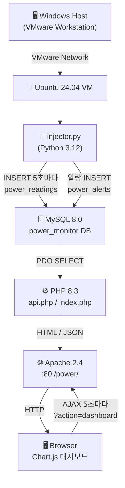
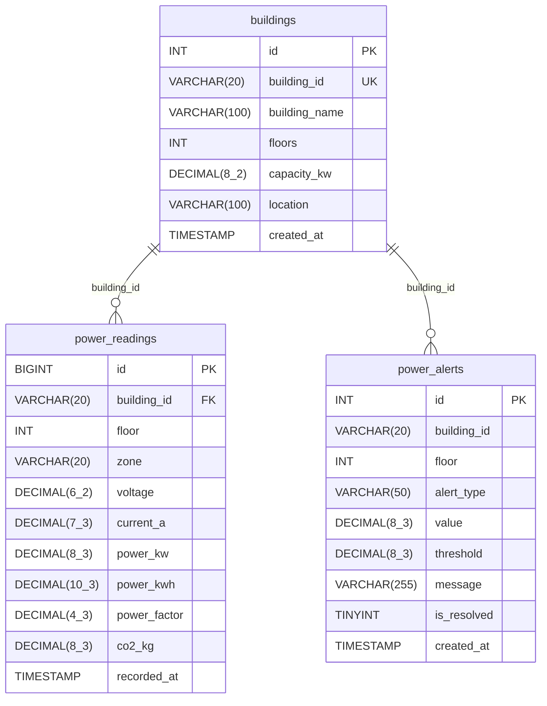

# 건물 전력 사용량 실시간 모니터링 시스템 - 구현 문서

## 1. 프로젝트 개요

| 항목 | 내용 |
|------|------|
| 프로젝트명 | 건물 전력 사용량 실시간 모니터링 시스템 |
| 목적 | LAMP Stack 위에서 가상 전력 데이터를 생성·저장하고 PHP 대시보드로 시각화 |
| OS | Ubuntu 24.04 LTS (VMware Workstation) |
| Web Server | Apache 2.4 |
| Database | MySQL 8.0 |
| Backend | PHP 8.3 |
| Data Generator | Python 3.12 |
| Frontend | Chart.js 4.4 (CDN), Vanilla JS |
| 갱신 주기 | 5초 (meta refresh + AJAX 폴링) |

---

## 2. 전체 시스템 블록도



---

## 3. 데이터베이스 ERD



---

## 4. Step별 구현 설명

### Step 1 — setup_lamp.sh

- `apt update && upgrade` 후 Apache2, MySQL 8.0, PHP 8.3, Python3/pip3 순서로 설치
- `systemctl enable + start`로 서비스 자동 시작 등록
- MySQL root 권한으로 `power_monitor` DB와 `power_user` 계정 생성, 권한 부여
- 마지막에 `sql/schema.sql`을 `power_user` 계정으로 자동 실행

### Step 2 — sql/schema.sql

- **buildings**: 건물 기본 정보 테이블. `building_id`를 UNIQUE 키로 사용
- **power_readings**: 5초마다 쌓이는 시계열 측정값. `(building_id, recorded_at)` 복합 인덱스로 조회 최적화. `building_id` → buildings FK
- **power_alerts**: 임계값 초과 시 자동 생성. `is_resolved=0`이 활성 알람
- 5개 건물 초기 데이터는 `INSERT IGNORE`로 중복 실행에 안전

### Step 3 — python/injector.py

- `argparse`로 `--interval`, `--count`, `--once` 옵션 지원
- 시간대별 `time_factor`를 사인파 + 구간 선형 보간으로 계산 (야간 30% ~ 업무 100%)
- 각 측정값 공식 적용 후 `executemany`로 일괄 INSERT (5개 건물 동시)
- 알람 임계값 초과 시 `power_alerts` INSERT, 콘솔 로그 출력

### Step 4 — php/config.php

- DB 접속 상수 정의, `get_pdo()` 싱글턴 함수로 PDO 연결 재사용
- `ERRMODE_EXCEPTION` + `FETCH_ASSOC` + `EMULATE_PREPARES=false`

### Step 5 — php/api.php

- `?action=dashboard` : 최신값(latest) + 30분 추이(trend) + 활성 알람(alerts) + 합계(stats)를 한 번에 JSON 반환
- `?action=history&building_id=BLDG-A` : 해당 건물 최신 50건 이력 반환
- 모든 응답 헤더에 `Content-Type: application/json; charset=utf-8`

### Step 6 — php/index.php

- 다크 테마 (#0f1117) CSS-only 레이아웃, 좌측 고정 사이드바 220px
- PHP 초기 렌더링 + Chart.js AJAX 폴링(5초) 이중 갱신 구조
- 게이지 바: 0~70% 초록 / 70~90% 주황 / 90~100% 빨강
- 라인 차트(30분 추이) + 수평 바 차트(현재 부하율) 2개
- 알람 패널 색상: over_load=빨강, voltage_drop=주황, low_pf=노랑, peak_demand=보라

---

## 5. 건물별 전력 프로파일

| building_id | 건물명 | power_base (kW) | power_range (kW) | voltage_base (V) | capacity_kw |
|-------------|--------|-----------------|------------------|------------------|-------------|
| BLDG-A | 본관 | 250 | 80 | 220 | 500 |
| BLDG-B | 별관 | 150 | 50 | 220 | 300 |
| BLDG-C | 공장동 | 600 | 150 | 380 | 800 |
| BLDG-D | 주차타워 | 80 | 30 | 220 | 150 |
| BLDG-E | 데이터센터 | 850 | 50 | 220 | 1000 |

---

## 6. 알람 임계값 표

| alert_type | 조건 | 비고 |
|------------|------|------|
| over_load | power_kw > capacity_kw × 0.90 | 90% 과부하 |
| peak_demand | power_kw > capacity_kw × 0.95 | 95% 피크 수요 |
| voltage_drop | voltage < 200 V | 전압 강하 |
| low_pf | power_factor < 0.85 | 역률 불량 |

---

## 7. 실행 순서

```bash
# 1. LAMP 스택 설치 (최초 1회, root 권한)
sudo bash setup_lamp.sh

# 2. 웹 배포 (root 권한)
sudo bash deploy.sh

# 3. Python 데이터 생성기 실행 (백그라운드)
python3 python/injector.py --interval 5 &

# 4. 브라우저 접속
#    http://localhost/power/

# 옵션 예시
python3 python/injector.py --interval 3 --count 20  # 3초마다 20회
python3 python/injector.py --once                    # 1회 테스트
```

---

## 8. 파일 구조

```
building-power-monitor/
├── setup_lamp.sh          # LAMP 자동 설치 스크립트
├── deploy.sh              # 웹 서버 배포 스크립트
├── apache/
│   └── power-monitor.conf # Apache VirtualHost 설정
├── sql/
│   └── schema.sql         # DB 스키마 + 초기 데이터
├── python/
│   └── injector.py        # 가상 전력 데이터 생성기
├── php/
│   ├── config.php         # DB 설정, PDO 싱글턴
│   ├── api.php            # JSON API 엔드포인트
│   └── index.php          # 대시보드 HTML
├── process.md             # 구현 문서 (이 파일)
└── README.md              # GitHub README
```
